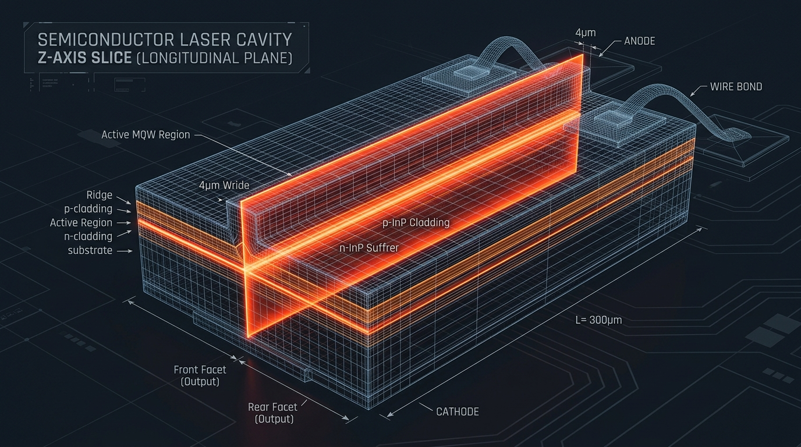

# PLaser 激光二极管 EDA 仿真套件：用户手册与技术参考

欢迎使用 **PLaser** 激光二极管 EDA 仿真套件用户手册。本文件作为基于物理信息神经网络（PINN）的电信级激光器实时设计仪表盘的本地部署、操作与技术参考指南。

---

## 1. 器件架构与求解器映射（四个几何映射面板）

PLaser 将电信级激光器物理封装的复杂三维结构，映射至简化的几何求解器，实现了秒级以下的光-电-热实时耦合分析。

### 1.1 三维物理器件的切片分解
为了分解完整的三维多物理场方程，我们将物理上的三维激光芯片波导结构沿两个正交面进行切片分解：
* **图 a (3D 芯片实体图):** 显示了半导体脊波导激光二极管芯片的实体装配结构。
* **图 b (横向截面 x-y 切片):** 突出显示了垂直于光传播方向的横向截面切片，该截面由 2D Elmer FEM 求解。
* **图 c (纵向腔 z 切片):** 突出显示了沿有源区传播方向（z 轴）的纵向腔网格切片，该通道由 1D 求解器离散。




### 1.2 几何求解器映射面板说明

### 面板 1：物理器件装配（14引脚蝶形封装与激光二极管芯片）
在光纤通信中，边发射半导体激光器被集成在标准的 **14 引脚蝶形封装**中。该封装集成了激光芯片、热电制冷器（TEC）、温度监测热敏电阻、光隔离器和光纤耦合透镜。 

激光芯片本身（见**图 a**）是生长在 **磷化铟（InP）** 衬底上的微米级半导体叠层。电流通过上部的条形电极注入，在有源 **多量子阱（MQW）** Waveguide 中产生光学增益。脊波导结构在水平和垂直方向限制光场，使相干的基模光束从解理的镜面出射。

### 面板 2：过渡热沉（热沉装配与热耗散）
为了使高功率电信激光器稳定运行而不发生热衰退，激光芯片以 **p面朝下（p-side down）** 的方式贴装在具有高导热率的 **铜（Cu）或碳化硅（SiC）过渡热沉**上。

**横向截面属性:** 是的！过渡热沉视图代表了封装的横向截面（x-y 面），从输出面方向看去。它展示了热量从有源区（MQW）通过 p 电极层流向铜热沉的散热路径。有源区产生的焦耳热和俄歇非辐射复合热（$CN^3$）通过极短的路径传导到热沉，并被底部的 TEC 吸收。过渡热沉的底部设定为恒定环境温度 $T_0$，作为热扩散的冷端边界。

### 面板 3：2D 横向模型（2D Elmer FEM 横向截面求解器）
横向截面（垂直于光传播方向的 $x-y$ 面，见**图 b**）决定了光波导的模场 confinement 和 localized 物理特性。参考求解器 **Elmer FEM** 求解横向截面上的二维耦合方程：
* **静电场（Poisson 方程）:** 求解在接触电极偏置下的局部静电势 $\psi(x, y)$。
* **载流子输运（漂移-扩散方程）:** 控制侧向电流扩展和电子/空穴浓度分布。
* **波动光学（矢量 Helmholtz 方程）:** 计算光波导的本征模场形状 $\Psi(x, y)$ 和限制因子 $\Gamma$。
* **热传导（傅里叶热传导方程）:** 计算脊波导截面上的局部晶格温度分布 $T(x, y)$ 及其热点。
* **坐标系映射:** Elmer 求解器在二维物理网格区间 $[−6, 6] \times [0, 4.23]\,\mu\text{m}$ 上工作。该物理坐标系映射至应用软件视口中：$x_{app} = y_{Elmer}$（裁剪至 $[-3.5, 3.5]$），$y_{app} = z_{Elmer} - 2\,\mu\text{m}$（将有源区中心平移至坐标零点）。

### 面板 4：1D 纵向腔（1D 纵向腔体架构）
沿传播方向（$z$ 轴，见**图 c**，腔长 $L$），前向和后向光波包络在镜面间发生反射。在非对称腔面镀膜中（如后腔面 $R_1 \approx 90\%$ 高反膜，前腔面 $R_2 \approx 5\%$ 增透膜），光功率朝前向 facet 指数级增长。

这种功率激增导致前腔面附近的载流子被激射光子快速消耗，形成纵向载流子浓度凹陷，称为 **空间烧孔（SHB）** 效应，它会直接影响单模激射的波长稳定性。
* **网格离散映射:** 纵向通道被离散为从 $z=0$ (高反 facet) 到 $z=L$ (输出 facet) 的 51 点计算网格，求解前向与后向光波的耦合速率方程。软件中直观绘制了腔体格点、镜面反射、前/后向波矢量以及输出激光的示意架构，而非简单的物理曲线图。

---

## 2. 软件运行模式（两个视图面板）

PLaser 仪表盘提供两个针对设计优化和局部物理场检查的专业运行模式。

### 运行模式 1：多物理场综合仪表盘
提供全局的光-电-热耦合性能综合视图。
* **左侧控制面板 (设计参数与运行环境):** 包含镜面反射率（$R_1, R_2$）、腔长（$L$）、环境温度（$T_0$）和注入电流（$I_{\text{act}}$）的滑块。
* **右侧主图表区 (6 视口):**
  1. **载流子浓度 $N(z)$:** 展示腔体纵向载流子分布，高亮空间烧孔效应（SHB）。
  2. **纵向光功率 $P(z)$:** 实时绘制沿传播轴的功率增加曲线。
  3. **2D 横向模场 $|\Psi(x,y)|^2$:** 显示有源区内的本征模式形状。
  4. **2D 温度分布 $T(x,y)$:** 展示向铜过渡热沉传导的二维温度场。
  5. **水平切面分布 $|\Psi(x,0)|^2$:** 有源区中心的横向光强割线图。
  6. **垂直切面分布 $|\Psi(0,y)|^2$:** 波导中心的纵向光强割线图。
* **性能指标卡:** 动态输出总功率（mW）、电光转换效率（WPE, %）、总终端电流和当前器件激射状态。

### 运行模式 2：3D 腔内物理场分析仪
用于细致检查沿腔体 z 轴的局部横截面状态。
* **左侧控制面板 (3D 腔体控制器):** 控制滑块切换为腔体 z 位置（从 0 至 $L$），并配有单张精简指标卡输出该位置处的局部 z、局部载流子浓度 $N(z)$ 和局部光功率 $P(z)$。
* **右侧主图表区 (4 视口):**
  * **上排 (局部 2D 截面):** 显示在选定 z 截面位置处的局部模场截面 $|\Psi(x,y)|^2$ 和温度截面 $T(x,y)$。
  * **下排 (3D 空间场分布):** 展示沿 $y=0$ 对称面的 $x-z$ 平面的三维包络表面图，直观再现腔内激射光强三维空间包络 $|\Psi(x,0,z)|^2$ 和热分布三维地貌 $T(x,0,z)$。

---

## 3. 安装与新手上门指南

让 PLaser 在您的本地电脑上运行只需不到 2 分钟。

### 3.1 克隆并配置虚拟环境
为隔离依赖并避免 Windows 的 `MAX_PATH` 路径名过长问题（WinError 206），请在较浅的磁盘路径（如 `C:\PLaser`）下创建环境：

```powershell
# 克隆代码仓库
git clone https://github.com/ZhenwenWan/PLaser.git
cd PLaser

# 创建并激活 Python 虚拟环境
python -m venv .venv
.\.venv\Scripts\Activate.ps1

# 安装 CPU 版 PyTorch、Streamlit、Matplotlib 和 OpenCV
pip install -r requirements.txt
```

确认依赖包正确导入：
```powershell
python -c "import numpy, matplotlib, streamlit, torch, cv2; print('PLaser 环境状态: OK')"
```

### 3.2 启动预训练的 Streamlit 仪表盘
使用预存的训练权重运行 Streamlit Web 仪表盘：
```powershell
python -m streamlit run app.py
```
*预期结果:* 浏览器将自动打开 `http://localhost:8501`。滑动滑块，多物理场仿真曲线会在 5 毫秒内更新。

### 3.3 可选的其他脚本运行
* **重新生成仿真训练集:**
  ```powershell
  python generate_dataset.py
  ```
  *预期结果:* 运行 2.5D 纵向射击法求解器，在约 46 秒内生成 1,500 个随机参数点并写入 `./data/pinn_inputs.npy`。
* **重新训练 PINN 代理模型:**
  ```powershell
  python train_pinn.py
  ```
  *预期结果:* 训练 PyTorch 神经网络以拟合数据和物理连续性损失，在 3 秒内将权重存盘至 `./models/pinn_laser_model.pt`。
* **生成 sweeps 动画演示视频:**
  ```powershell
  python generate_animation.py
  ```
  *预期结果:* 编译一段 24 秒长的 HD H.264 演示视频，完美模拟包括左侧控制滑块和右侧主视口在内的完整软件界面，保存为 `./PLaser_Demonstration.mp4`。

---

## 4. 算法方法、物理学与精度验证

### 4.1 物理信息损失函数（PINN）
PLaser 不仅进行数据插值，而且在神经网络的反向传播过程中施加了半导体物理定律约束。在网格点上强加了局部的载流子速率连续性方程：
$$G_{\text{inj}} - R_{\text{rec}}(N(z)) - R_{\text{stim}}(N(z), P_{\text{tot}}(z)) = 0$$

这一物理项可有效惩罚不合物理规律的输出，使模型在阈值点附近（$I \approx I_{\text{th}}$）或高温严重热衰减（$T_0 > 320\text{ K}$）等非线性区域依然保持极高的物理一致性。

### 4.2 计算时间与加速比对比

| 求解器方法 | 运行耗时 (Latency) | 精度系数 ($R^2$) | 在 EDA 流程中的角色 |
| :--- | :--- | :--- | :--- |
| **传统 Elmer 2D FEM 求解器** | 12 - 25 秒 | 1.000 (参考标准) | 求解横向波导本征模场 |
| **2.5D 纵向射击法求解器** | 1.2 - 2.8 秒 | 1.000 (参考标准) | 用于批量产生仿真数据集 |
| **PLaser PINN 代理模型** | **< 5 毫秒** | **> 0.997** | 实时全局芯片参数优化扫参 |

高达 **1,000,000 倍的加速**，使工程师能够像拨动滑块一样实时评估成千上万个激光腔体设计。

### 4.3 精度验证结果
PINN 代理模型在保留的独立验证集上完成了验证。预测值与真实 Elmer / 射击法求解器值对齐良好：
* **光输出功率 $R^2$:** 0.998
* **电光转换效率 WPE $R^2$:** 0.997
* **终端注入电流 $R^2$:** 0.999
* **平均功率残差:** < 0.45 mW
