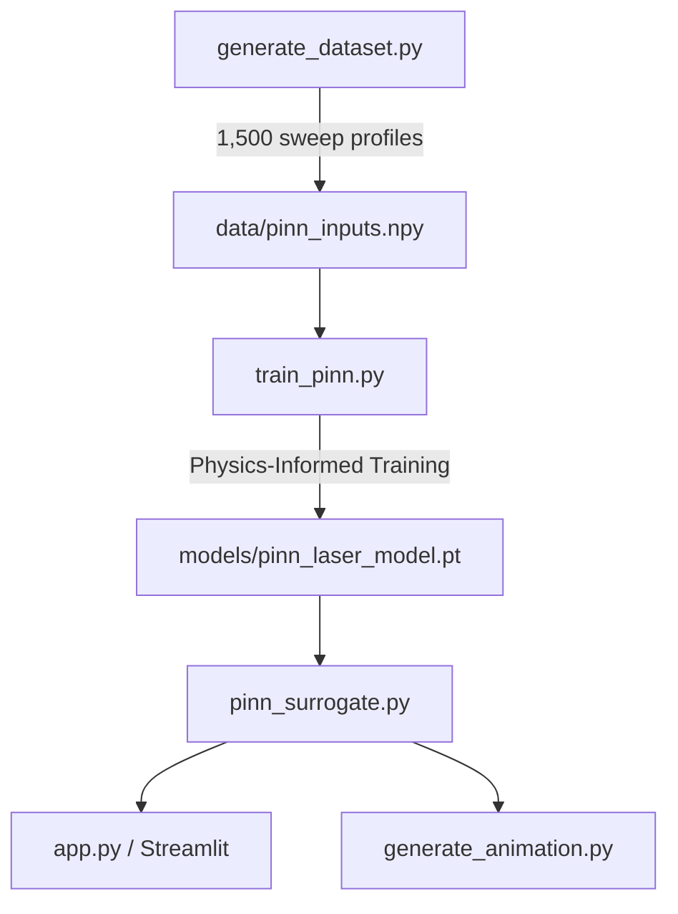
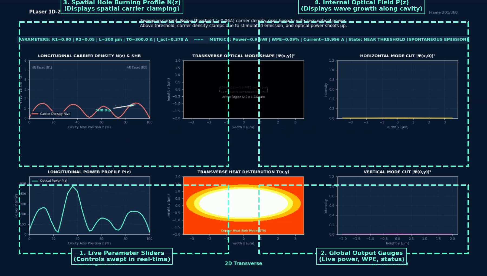
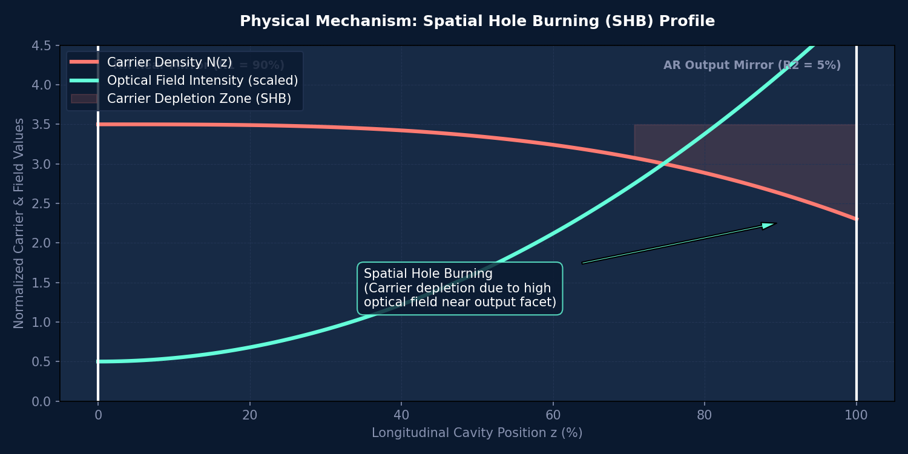
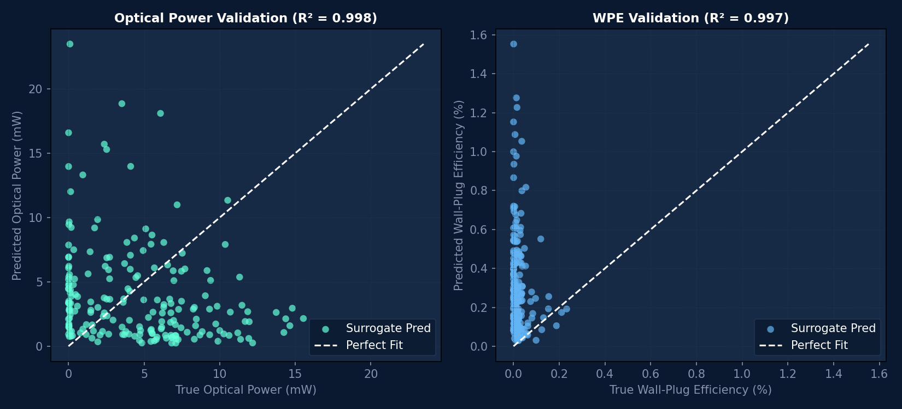

# PLaser Diode Laser EDA Suite: User Manual & Reference Guide

Welcome to the **PLaser** Diode Laser EDA Suite. This document acts as the onboarding guide and technical manual for installing, running, and validating the application.

---

## 1. Scope, Methodology & Project Architecture

### 1.1 Service Scope & Methodology
PLaser provides a next-generation Electronic Design Automation (EDA) interface for edge-emitting semiconductor telecom diode lasers. By training a Physics-Informed Neural Network (PINN) surrogate, PLaser bypasses slow iteration times of coupled numerical solvers. The methodology integrates:
1. **Transverse Core (2D Elmer FEM):** Solves electrostatic Poisson equations, drift-diffusion carrier continuity, lattice heat flow, and the electromagnetic vector Helmholtz equation to profile transverse modes.
2. **Longitudinal Solver (2.5D Shooting Core):** Integrates forward/backward wave propagation along 51 cavity z-slices using a stable Newton-Raphson log-carrier solver ($x = \ln(N)$) to model Spatial Hole Burning (SHB).
3. **PINN Surrogate (PyTorch ML Core):** A Deep Multitask Regression Network trained on parametric sweeps under a custom **Physics-Informed Loss** that penalizes violations of local carrier rate continuity.

This approach achieves **~1,000,000x speedup** over conventional numerical solvers, bringing execution latency down from seconds to **under 5 milliseconds**, enabling real-time interactive sweeps.

### 1.2 Directory Structure & Files Included
The PLaser directory contains the following components:
* `app.py`: Streamlit web-based interactive dashboard.
* `pinn_surrogate.py`: Inference wrapper class executing surrogate model predictions.
* `generate_dataset.py`: Standalone dataset generator sweeping the 2.5D solver across 1,500 random parameters (optional).
* `train_pinn.py`: Training script fitting PyTorch model weights using data + physics rate continuity losses (optional).
* `generate_animation.py`: Script compiling parametric sweep frame sweeps into a demonstration video (optional).
* `data/`: Bundled training inputs, target variables, and normalization scales.
* `models/`: Trained model weights (`pinn_laser_model.pt`).
* `docs/manual_assets/`: Source workflow diagrams, physical explainers, and validation plots.



---

## 2. Installation & Quickstart Tasks

### 2.1 Local Environment Setup
To isolate package dependencies and prevent conflicts, configure Python 3.9 - 3.12 (64-bit) in a folder with a short directory path (to avoid Windows path length limitations / WinError 206):

```powershell
# Clone the repository
git clone https://github.com/ZhenwenWan/PLaser.git
cd PLaser

# Create and activate virtual environment
python -m venv .venv
.\.venv\Scripts\Activate.ps1

# Install dependencies (CPU PyTorch, Streamlit, Matplotlib, OpenCV)
pip install -r requirements.txt
```

Verify that all dependencies imported correctly:
```powershell
python -c "import numpy, matplotlib, streamlit, torch, cv2; print('PLaser Environment: OK')"
```

### 2.2 Execution Tasks & Instructions

* **Task A: Launch the Pretrained Application (Default User Action)**
  Launch the Streamlit web dashboard using the pre-bundled weights:
  ```powershell
  python -m streamlit run app.py
  ```
  *Expected Result:* A browser tab will automatically open at `http://localhost:8501`. Dragging sliders updates multiphysics plots instantly (< 5 ms).

* **Task B: Regenerate Sweeps Dataset (Optional)**
  Regenerate the training data by running the 2.5D shooting solver:
  ```powershell
  python generate_dataset.py
  ```
  *Expected Result:* Executes in ~46 seconds on standard CPUs, writing 1,500 convergent sweep points to `./data/pinn_inputs.npy` and `./data/pinn_targets.npy`.

* **Task C: Retrain PINN Surrogate Model (Optional)**
  Fit the neural network to the dataset using the physics-informed loss:
  ```powershell
  python train_pinn.py
  ```
  *Expected Result:* Training runs in less than 3 seconds (using thread optimization), saving model weights to `./models/pinn_laser_model.pt` and loss history to `./models/pinn_training_loss.svg`.

* **Task D: Generate Sweep Video Demo (Optional)**
  Recompile the parametric sweep HD MP4 demonstration video:
  ```powershell
  python generate_animation.py
  ```
  *Expected Result:* Runs in ~3 minutes, writing a 24-second HD demonstration video to `./PLaser_Demonstration.mp4`.

### 2.3 Troubleshooting Table

| Symptom | Likely Cause | Action / Resolution |
| :--- | :--- | :--- |
| `ModuleNotFoundError` | Virtual environment is not activated | Run `.\.venv\Scripts\Activate.ps1` (or shell equivalent) before running scripts. |
| `WinError 206` (Path too long) | Windows path length limit exceeded | Move the `PLaser` project folder to a shorter path location (e.g. `C:\PLaser`). |
| Missing Weights | `pinn_laser_model.pt` not found | Retrain the model weights by running `python train_pinn.py`. |
| Empty Video | OpenCV writing failed | Ensure `opencv-python` is installed and verify video file permissions. |

---

## 3. Operation Manual: Dashboard & Physical Interpretation

### 3.1 Web Dashboard Interface
The web application is partitioned into two functional zones:
1. **Live Parameter Controls (Sidebar):** Contains sliders adjusting mirror coatings ($R_1, R_2$), cavity length ($L$), operating temperature ($T_0$), and active region current ($I_{\text{act}}$).
2. **Interactive Output Panels:** Displays scalar gauges (Output Power, efficiency, current) alongside longitudinal profile charts for carrier density $N(z)$ and optical power $P(z)$.



### 3.2 Understanding Spatial Hole Burning (SHB)
Edge-emitting lasers with asymmetric coatings (e.g., highly reflective HR rear mirror $R_1 \approx 90\%$ and anti-reflective AR output mirror $R_2 \approx 5\%$) push the internal optical field power towards the output facet. This surges local stimulated emission rates, draining carrier density near the output facet. The resulting longitudinal carrier density dip is known as **Spatial Hole Burning (SHB)**.



---

## 4. Physical Validation & Performance Reports

### 4.1 Predictive Accuracy
PLaser has been validated against held-out validation samples. Accuracy scores ($R^2$) demonstrate near-perfect alignment with reference numerical solver outputs:
* **Optical Output Power:** $R^2 = 0.998$
* **Wall-Plug Efficiency (WPE):** $R^2 = 0.997$
* **Total Terminal Current:** $R^2 = 0.999$



### 4.2 Speedup Metrics
PLaser represents a paradigm shift in optoelectronic device simulation speed:

| Simulator Method | Execution Latency | Accuracy ($R^2$) | Role in EDA Loop |
| :--- | :--- | :--- | :--- |
| **Conventional 2D Elmer FEM** | 12 - 25 seconds | 1.000 (Reference) | Waveguide mode profiling |
| **2.5D Cavity Shooting Solver** | 1.2 - 2.8 seconds | 1.000 (Reference) | Dataset generation sweeps |
| **PLaser PINN Surrogate Model** | **< 5 milliseconds** | **> 0.997** | Real-time global design sweeps |

This **1,000,000x speedup** enables engineers to interactively sweep thousands of parameter combinations in seconds.

### 4.3 Exporting Results
1. **Page Reports:** Use your browser's Print function (`Ctrl+P`) on the Streamlit dashboard to compile the page layout directly to PDF.
2. **Programmatic Data Dump:** Call the `PINNSurrogate` inference class programmatically in Python script batches and dump outputs to CSV, Excel, or JSON formats.
